# TheSCPFoundationCRUD-HTML

My SCP Foundation CRUD but just the **Front-End** part for the subject _Markup Language_.

This is just the Front-End of my CRUD so the Back-End part (made originally in JSP and TSQL) has been deleted.
All the pages are linked in the logical way (if you click in _Log In_ you can access to the login page or if you place username and password you will access to the editor page even if the password or the username are wrong).

## INDEX:

1. [Search And Order](#search-and-order)
2. [Login And SignUp](#login-and-signup)
3. [Return Back](#return-back)
4. [Additional Information](#additional-information)
5. [Screenshots](#screenshots)

## SEARCH AND ORDER

To Search something, click on the "**Search...**" bar and then press Enter or type whatever you want and press enter. I've added by default some search with their correspondent result and how it has to be shown.
The order option (_below the Search bar_), logically **doesn't work** because it was made with JSP.
Search and Order option are put into Reader and Editor pages.

## LOGIN AND SIGNUP

To Log In and Sign Up, just _place whatever is required_ in each field.
After that, you will access to the _Editor page_ logged in as **_User1_**, no matter whatever you type in the fields.

## RETURN BACK

To return back in each page, you have to click on the SCP Logo (to return to index) or, to click to Log Out (to return to login in Editor pages). Also, whenever you search, you have the option _Return_ to come back to the Reader or Editor page, depending on the search. Also you can use the *Browser's Arrow* to move into pages.

## ADDITIONAL INFORMATION

To learn more about the ideas and the process of creation of this CRUD, you can visit [my repository](https://github.com/DavidAntunezPerez/TheSCPFoundation-CRUD).

## SCREENSHOTS

### **Index:**

### **Access as a Reader:**

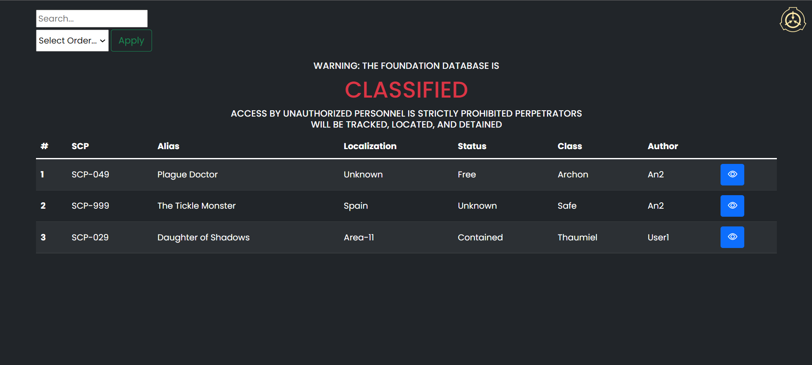
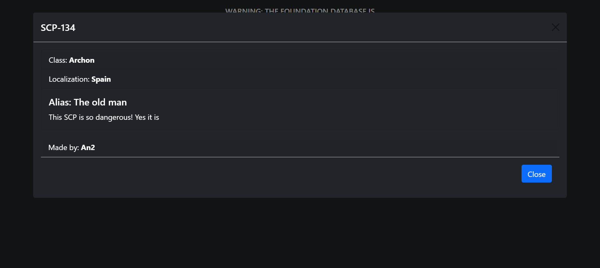
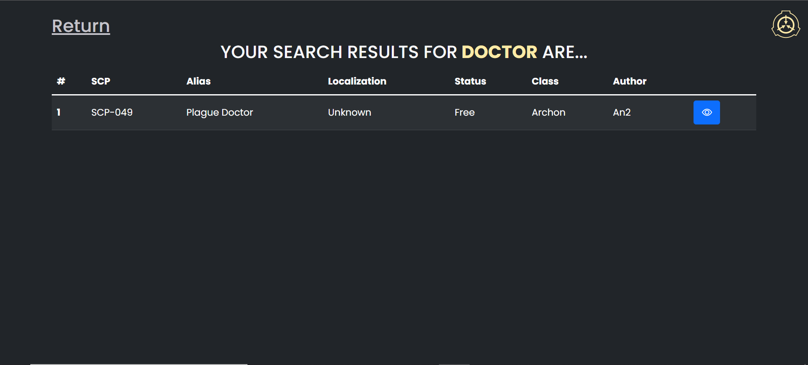

### **Log In & Sign Up:**

### **Access as an author:**

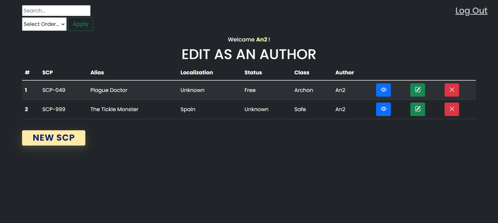
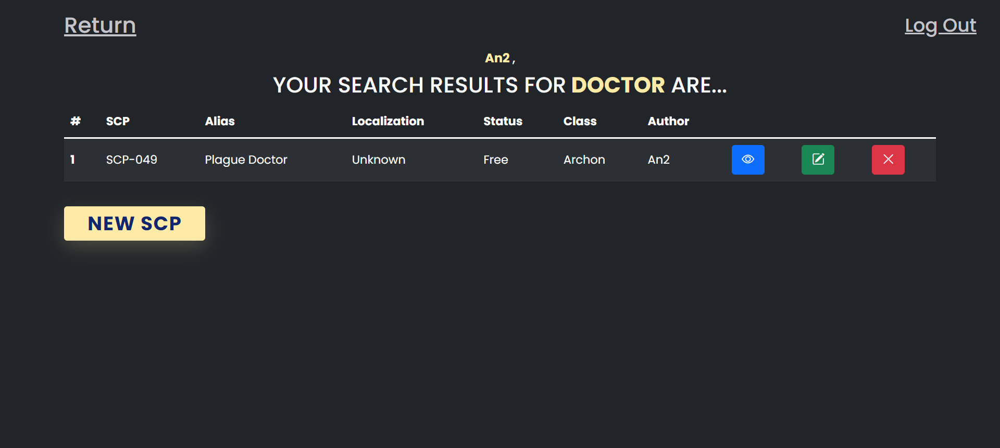

### **Access as root:**

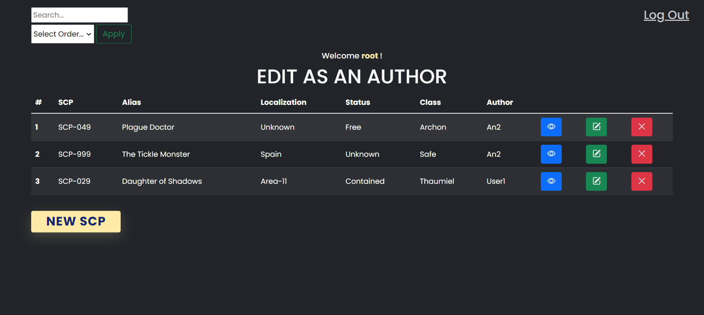
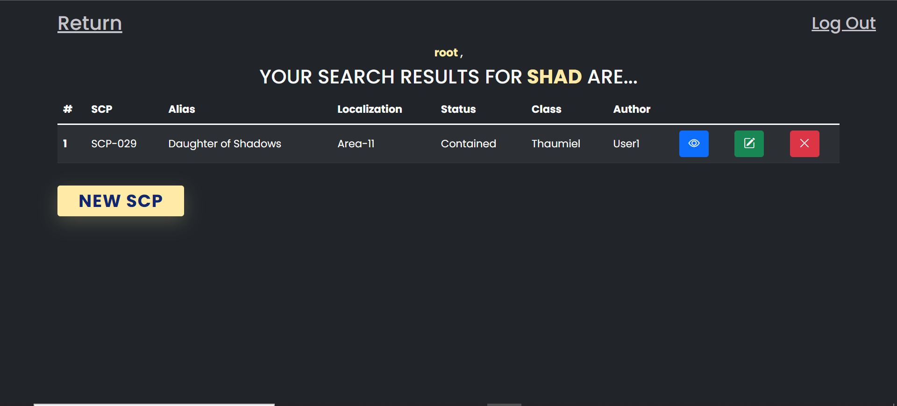

### **DELETE:**

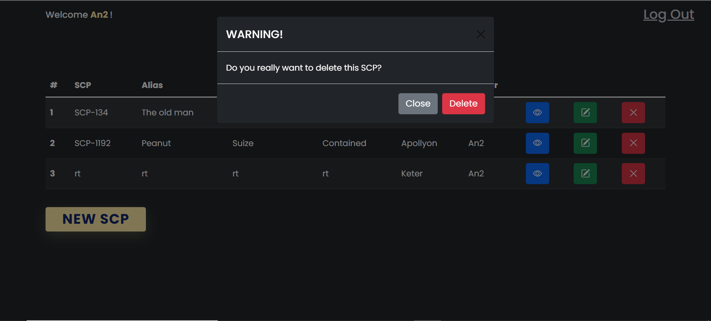

### **INSERT:**

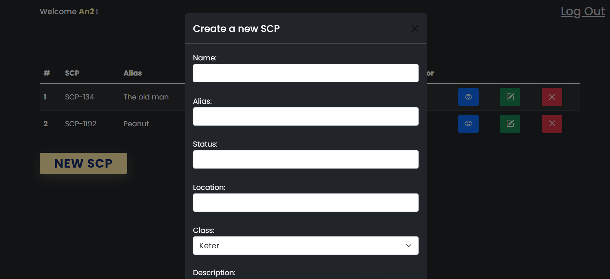
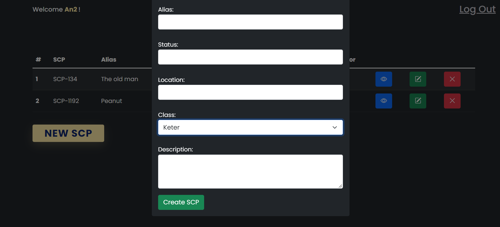

### **EDIT:**

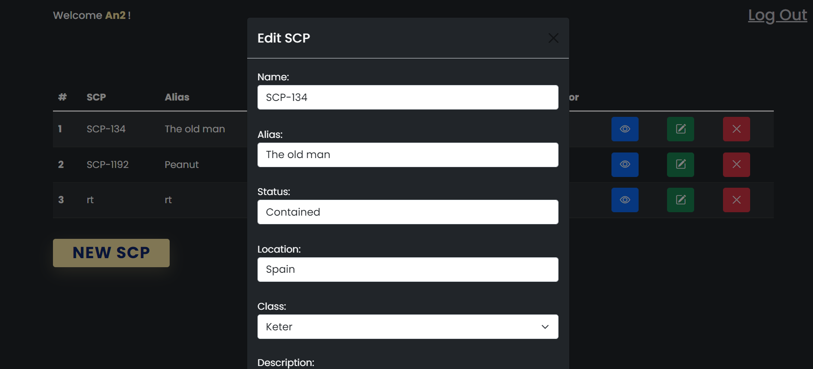
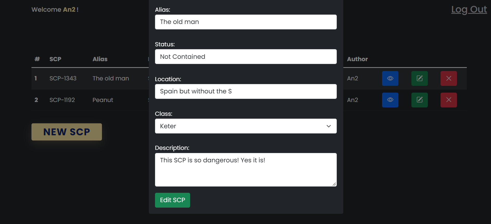
